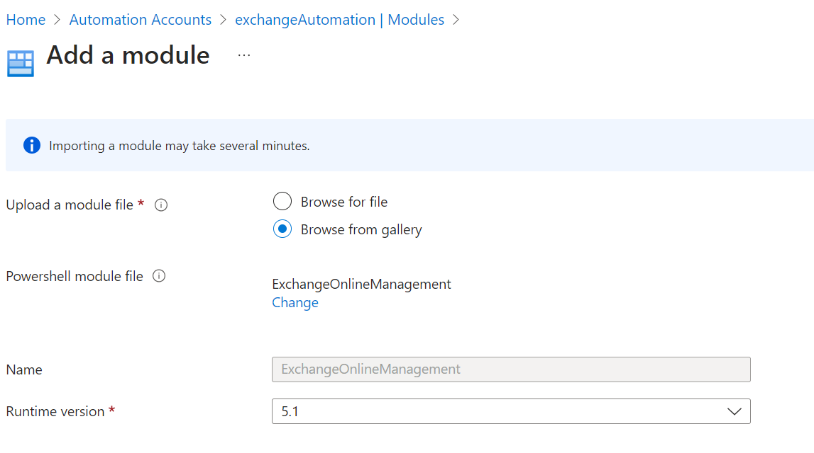

## Problem

I ran into the following issue for one of my customer that was using Azure automation account to run a PowerShell runbook against Exchange Online.

Since the second week of August 2023, the runbooks that were scheduled to run daily would fail with the following error:

> Connecting to remote server outlook.office365.com failed with the following error message : The request is not serviced on the server. Your tenant quota has exceeded. Please wait for few minutes and retry again. For more information, see the about_Remote_Troubleshooting Help topic. (Connecting to remote server outlook.office365.com failed with the following error message : The request is not serviced on the server. Your tenant quota has exceeded. Please wait for few minutes and retry again. For more information, see the about_Remote_Troubleshooting Help topic.)

## Cause

After some research I noticed that the automation account was using an old version of the Exchange Online PowerShell version. The version installed was v2.x, while it should be at least version 3.x.

## Solution

To resolve this, do the following:

1. Using the Azure Portal, navigate to the automation account
2. In the navigation menu, under *Shared Resources*, select ***Modules***
3. Verify the version of the ExchangeOnline module installed
4. CLick Add a Module (this wil update already installed modules)
5. In Add a Module, Select the following:
   1. For *Upload a module file*, select ***Browse from gallery***
   2. For PowerShell module file, search for ***ExchangeOnline*** and select ***ExchangeOnlineManagement***
   3. For Runtime version, you probably want to select 5.1. for production workloads.
6. This will update the existing ExchangeOnlineModule and should only take a minute.

The screenshot below is an example of the Add a Module screen.

After doing this, the next time the runbook runs, it should finish successfully again.

### Conclusion

You should keep your PowerShell modules updated for your automation accounts. MVP and GitHub star Barabara Forbes wrote a nice post about how to automate this in this article: [Script: Update PowerShell Modules in an Automation Account](https://4bes.nl/2019/09/05/script-update-all-powershell-modules-in-your-automation-account/)