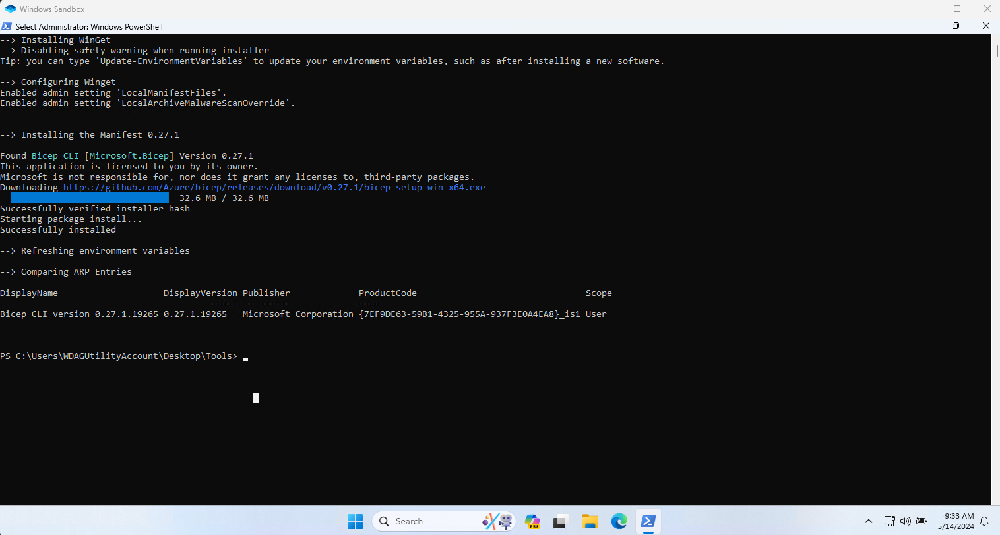

## Index

- [Index](#index)
- [Introduction](#introduction)
  - [Background: The winget package repository](#background-the-winget-package-repository)
- [Prerequisites](#prerequisites)
- [Steps](#steps)
  - [Preparation and validation](#preparation-and-validation)
  - [Create the winget manifest files for the installer package](#create-the-winget-manifest-files-for-the-installer-package)
  - [Modify the manifest files and store them in a new branch of your forked repository](#modify-the-manifest-files-and-store-them-in-a-new-branch-of-your-forked-repository)
  - [Validate the manifest files](#validate-the-manifest-files)
  - [Test the manifest with Windows Sandbox](#test-the-manifest-with-windows-sandbox)
  - [Commit an push your changes](#commit-an-push-your-changes)
  - [Create a pull request to the microsoft/winget-pkgs repository](#create-a-pull-request-to-the-microsoftwinget-pkgs-repository)
  - [After successful merging of your pull request](#after-successful-merging-of-your-pull-request)
- [Closing notes](#closing-notes)
- [References](#references)

## Introduction

When using Windows client systems, installing applications and keeping them up-to-date used to be quite a hassle in the old days. In the past, I used to rely on [Chocolatey](https://chocolatey.org/) to keep all my applications up-to-date. Nowadays, I prefer to use the built-in [winget](https://learn.microsoft.com/en-us/windows/package-manager/winget/) tool to install and update packages on Windows client devices.

However, sometimes you can run into one of these scenarios:

- The application you want to install is not available for installation using winget.
- The latest version of the application is not yet available for updating using winget.

Not all application publishers, including Microsoft, update the Winget package when a new version of their application is released. A lot of winget packages are being submitted by the community.
Other times, it just takes quite a while for a package to get updated, and personally I don't like waiting.
Thankfully, everybody can submit a winget package. 

Apart from doing yourself a favour, you will actively contributing to the community, helping other users of the application that use winget for package management. And it's a great learning experience, covering loads of different technology and tooling.

This article will show you how to update an existing winget package. In this example, I have used the Bicep cli as an example, as this is a package I frequently submit.

### Background: The winget package repository

The winget package repository is stored on Github and can be found here: [winget-pkgs](https://github.com/microsoft/winget-pkgs)
The actual software is not stored in this repository, but only manifest files that point to the actual installation package on a different location. This can be another GitHub repository, or the publisher's website for example.

All winget packages are stored in the [manifests](https://github.com/microsoft/winget-pkgs/tree/master/manifests) folder sorted on package/publisher's name, for example:

- 7zip can be found under [/manifests/7/7zip/7zip](https://github.com/microsoft/winget-pkgs/tree/master/manifests/7/7zip/7zip)
- Adobe Acrobat Reader can be found under [/manifests/a/Adobe/Acrobat/Reader](https://github.com/microsoft/winget-pkgs/tree/master/manifests/a/Adobe/Acrobat/Reader)
- Microsoft Bicep Cli can be found under [/manifests/m/Microsoft/Bicep](https://github.com/microsoft/winget-pkgs/tree/master/manifests/m/Microsoft/Bicep)
- Microsoft Azure Cli can be found under [/manifests/m/Microsoft/AzureCLI)](https://github.com/microsoft/winget-pkgs/tree/master/manifests/m/Microsoft/AzureCLI)

## Prerequisites

- A GitHub account
  - I highly recommend to sign your commits. See [Using a Yubikey with GitHub for signing your commits \| ictstuff.info](https://ictstuff.info/using-a-Yubikey-with-github-for-signing-your-commits)
- Windows 10 or Windows 11 machine with the winget client
- The [wingetcreate](https://github.com/microsoft/winget-create) latest version installed.
  - `winget install wingetcreate`
- Created a [fork](https://docs.github.com/en/pull-requests/collaborating-with-pull-requests/working-with-forks/fork-a-repo) of [winget-pkgs](https://github.com/microsoft/winget-pkgs) on GitHub.
- Activated the [Windows Sandbox optional feature](https://learn.microsoft.com/en-us/windows/security/application-security/application-isolation/windows-sandbox/windows-sandbox-overview) on your client machine.
  - I personally had some issues with the PowerShell command `Install-WindowsOptionalFeature`, so I used the GUI to install this:
    - Apps > Optional Features - More Windows Features
    - Check `Windows Sandbox` and reboot

## Steps

### Preparation and validation

For the Bicep Cli, I have subscribed to the repository's releases using the *watch* option - *custom* and selecting only `releases`

The instructions below are based on the release of [Bicep v0.27.1](https://github.com/Azure/bicep/releases/tag/v0.27.1)

- Check the open Pull requests on [microsoft/winget-pkgs on GitHub](https://github.com/microsoft/winget-pkgs/pulls), to make sure nobody has already submitted this package
  - Use this as a search filter: `is:pr is:open "bicep" in:title`
- On the release page of Bicep v.0.18.4, find the `bicep-setup-win-x64.exe` package and copy the link for the next step

> **IMPORTANT:** Make sure you copy the `bicep-setup-win-64.exe` and not the bicep-win64.exe

### Create the winget manifest files for the installer package

- On your machine, open a PowerShell prompt and enter the following: `wingetcreate update --urls <link to bicep-setup-win-x64-package> --version <versionNumber> <Winget.PackageName>`, so in this case this should be:
  - `wingetcreate update --urls https://github.com/Azure/bicep/releases/download/v0.27.1/bicep-setup-win-x64.exe --version 0.27.1 Microsoft.Bicep`
- This will create the following manifest files on your PC in the `C:\Users\<username>\manifests\m\Microsoft\Bicep\<0.xx.x>`
  - Microsoft.Bicep.installer.yaml
  - Microsoft.Bicep.locale.en-US.yaml
  - Microsoft.Bicep.yaml

### Modify the manifest files and store them in a new branch of your forked repository

- In GitHub, make sure your forked repository is synced
- In VSCode, open your fork repository
  - Make sure you are in the main/master branch
- Create a new branch from main/master.
  - In this case, I named the branch `feat-microsoft-bicep-v0.27.1`
- Switch to the new branch and create a new folder called `manifests\m\Microsoft\Bicep\0.27.1`
- Copy the 3 manifest files in this folder.
- Modify the following:
  - `Microsoft.Bicep.installer.yaml`
    - Add a `ReleaseDate: 'yyyy-MM-dd` line with the release date of this version
  - `Microsoft.Bicep.locale.en-US.yaml`
    - Add a `ReleaseNotes` parameter and copy the details from the releasenotes page, for example:

      ```text
      ReleaseNotes: |-
      Highlights
      Bicep Team:
      - "publishSource" is now GA! (#13899)
      - Implement the spread ... operator, other new functions, and indices on lambdas (#13658)
      - Support completions inside object spread (#14000)
      - Normalize indenting for multi-line descriptions (#14013)
      - Default levels for linting rules finalized (#13847)
      - Permit validation for property access on union types (#14017)
      Bugs and Features
      Bicep Team:
      - Clarify on JSONRPC format (#13825)
      - Support --outdir param with build-params (#13890)
      - Create 'use-secure-value-for-secure-inputs' linter rule (#13905)
      - Add detailed validation for UDFs with UDTs (#14011)
      - Fix for stack overflow issue (#14049)
      - Check namespaces in prefer-interpolation linter rule (#14050)
      - Support codefix for missing Bicep params (#14012)
      - Formatting rule improvements (#13945)
      - Recognize common keywords for resource type completions (#13721)
      - Show full path of built JSON file so it's clickable in vscode (#13787)
      - Try to fix 13333 (#13788)
      - Make some minor improvements to resource filter keywords and add filter keyword support for resource snippets (#13731)
      - 13842 Bicep linter doesn't recognise managementGroupResourceId as a r… (#13889)
      ```

    - Add a `ReleaseNotesUrl` parameter, for example:
      - `ReleaseNotesUrl: https://github.com/Azure/bicep/releases/tag/v0.27.1`
- Save the files and do not commit them yet.

### Validate the manifest files

- Open a PowerShell console session for this.
- Validate your manifest files using winget cli.
  - **Be sure to validate the modified manifest files in your git branch, not the original location**
  - For example:
    - `winget validate X:\git\GitHub\MarcoJanse\winget-pkgs\manifests\m\Microsoft\Bicep\0.27.1\`
- If everything is alright, it should say *`Manifest validation succeeded`*

### Test the manifest with Windows Sandbox

- Using PowerShell console session, navigate to your winget repository branch
- **Make sure you are still in the branch with the new manifest files, and not in master/main branch.**
  - For example: `cd X:\git\github\MarcoJanse\winget-pkgs\Tools\`
- Run the following to test the installation of Bicep using the manifest file in Windows Sandbox environment
  - `.\SandboxTest.ps1 ..\manifests\m\Microsoft\Bicep\0.27.1\`
- This will list the output below, open a Windows Sandbox environment where you should see a successful installation of the Bicep Cli.
- If you don't see a successful installation, you can check the winget log files on the sandbox to check for any solutions, try to install the package manually without winget and if that also fails, create a new issue in the source repository. In this case: [Azure/Bicep: Issues](https://github.com/Azure/bicep/issues)

```powershell
> .\SandboxTest.ps1 ..\manifests\m\Microsoft\Bicep\0.27.1\                                 
--> Validating Manifest
Manifest validation succeeded.

--> Checking dependencies
--> Starting Windows Sandbox, and:
    - Mounting the following directories:
      - C:\Users\MarcoJanse\AppData\Local\Temp\SandboxTest as read-only
      - C:\git\GitHub\MarcoJanse\winget-pkgs\Tools as read-and-write
    - Installing WinGet
    - Configuring Winget
    - Installing the Manifest 0.27.1
    - Refreshing environment variables
    - Comparing ARP Entries
```

Below is a screenshot of the sandbox and it's output if everything works.



### Commit an push your changes

- In VSCode, in your branch commit the 3 files and enter a commit message:
  - For example: `feat: microsoft-bicep-v0.27.1`
- Sync/pull changes to the remote repository.
  - Make sure you sync to your forked branch, not the original.

### Create a pull request to the microsoft/winget-pkgs repository

- Using GitHub, go to your forked winget-pkgs repository
  - Select your feature branch
  - Select your commit. (commit ahead)
- You should automatically get a compare between your commit and the base repository (microsoft/winget-pkgs) on the master/main branch.
- Verify the following:
  - base repository: `microsoft/winget-pkgs` and base: `master`
  - head repository: `MarcoJanse/winget-pkgs` and base: `feat-microsoft-bicep-v0.27.1`
  - *Able to merge* message is displayed
- Select ***[Create Pull Request]***
- Review all the questions and put an `x` between the brackets when it's okay.
- Select ***[Submit]*** if everything is okay
  - This will start the pipelines for validation and approval. The pipeline validation should finish successfully within approximately an hour. The approval after successful validation depends on a reviewer with write access and could take several days.

You can find my original pull request for this here: [feat: microsoft-bicep-v0.27.1 #153499 \| winget-pkgs repo on Github.com](https://github.com/microsoft/winget-pkgs/pull/153499#issuecomment-2109492304)

### After successful merging of your pull request

After the pull request has been approved and merged into main

- Check if the package is available using `winget upgrade` and if so update using `winget upgrade microsoft.Bicep` or `winget upgrade --all`
- If you just want to see your latest submitted package, with all the details - like the release notes - try `winget show microsoft.bicep`
- On GitHub, go your your forked winget-pkgs repository and sync it with upstream.
- Open the master branch of your localy cloned fork
  - Fetch and pull the updates into main
- Back on GitHub, remove the old feature branch that has been merged
- Back on your client do a `git fetch --prune`
  - This should list the local feature branch as deleted
- Remove the local branch using `git branch -D feat-microsoft-bicep-v0_xx.x`
  - The `-D` is necessary as this branch has been merged in the upstream and not in your forked master branch.

## Closing notes

I hope you liked this post and learned a some things about winget, git, VSCode, Windows Sandbox and you enjoyed contributing to the community. You might do lots of people a favour if you contribute often.

## References

- [Use the winget tool to install and manage applications \| Microsoft Learn](https://learn.microsoft.com/en-us/windows/package-manager/winget/)
- [Submit packages to Windows Package Manager \| Microsoft Learn](https://learn.microsoft.com/en-us/windows/package-manager/package/)
- [winget-pkgs \| GitHub.com](https://github.com/microsoft/winget-pkgs)
- [winget-create repository\| GitHub.com](https://github.com/microsoft/winget-create)
- [Windows Sandbox optional feature \| Microsoft Learn](https://learn.microsoft.com/en-us/windows/security/application-security/application-isolation/windows-sandbox/windows-sandbox-overview)