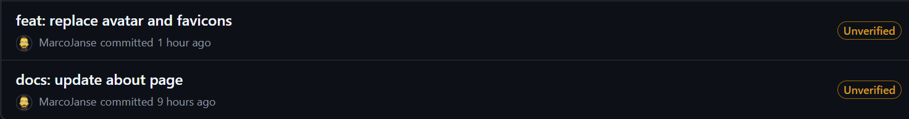
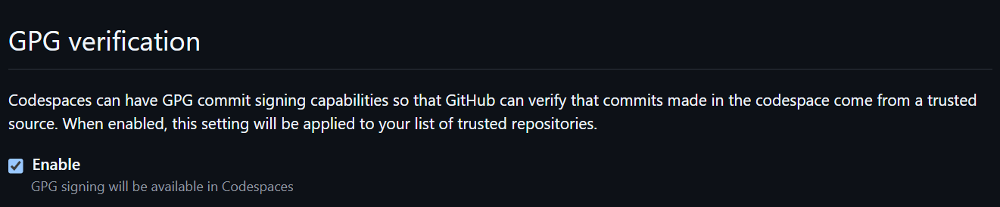
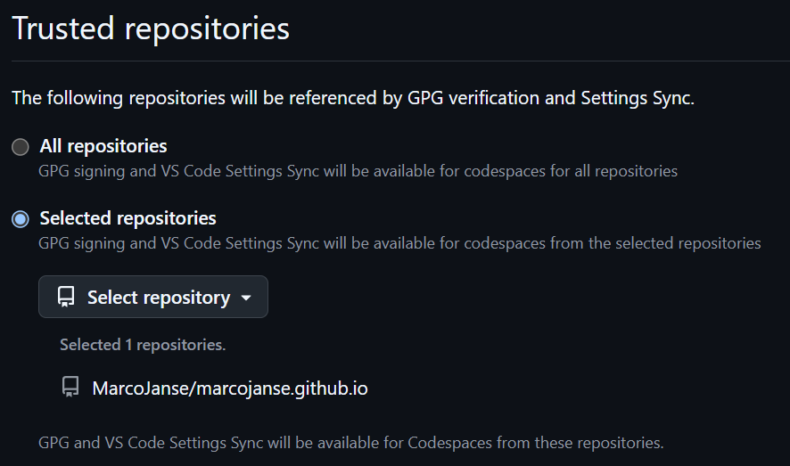

## Introduction

In one of my previous post I wrote about [Using a Yubikey with GitHub for signing your commits](). This works fine for your local Git client, but I noticed for this blog that my commits were not signed when using GitHub Codespaces.

Thankfully, signing your commits when using GitHub Codespaces is quite easy and does not require your Yubikey or any other GPG-supported hardware key: it's a separate GitHub-managed signing key — commits in Codespaces are signed using GitHub's own key, which won't show up in your personal GPG key settings since it's a key only GitHub uses for signing.

By default it's off: GPG verification is disabled for Codespaces you create. If you enable it, your commits are signed in repositories that you trust, and your trusted-repo list is shared between GPG verification and Settings Sync.

## Why is commit signing important?

- Authenticity: Verifies that the commit was really made by you.
- Trust: Helps collaborators and open source maintainers trust your contributions.
- Security: Prevents someone else from pretending to be you via forged commits.

GitHub displays a “Verified” badge when your commits are correctly signed and the key is associated with your account.

Below are the steps required to configure it.

## Configure GPG signing for Codespaces

1. GitHub → your profile picture → Settings → Codespaces
2. Under "GPG verification," toggle Enable
3. Choose your trusted repositories (GitHub recommends a selected list rather than "all")
4. Restart any already-running codespace for it to take effect — new codespaces pick it up automatically.

Below are screenshots of how this looks in your settings.

## Wrapping up

After configuring this and committing something on a trusted repository using Codespaces, the commit should now be signed.
I hope you found this article useful.

Happy coding! 😊